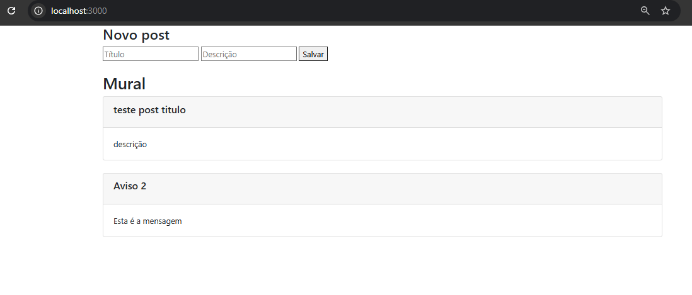

# MuralDeAvisos
Uma aplicação fullstack simples feita com nodejs e javascript .

## Passo a passo para rodar:

1. Usar o comando ``npm init `` caso já tenho o node instalado na máquina,senão faça um ``sudo apt-get install -y nodejs`` no seu terminal.
2. Instalar as depêndencias necessárias : ``npm bodyparser `` que servirá como middleware do projeto.
3. Rodar a aplicação por meio do comando ``node index.js`` ,já que este é o arquivo main.
4. Acessar ``http://localhost:3000/`` da sua máquina para ver o serviço rodando.
